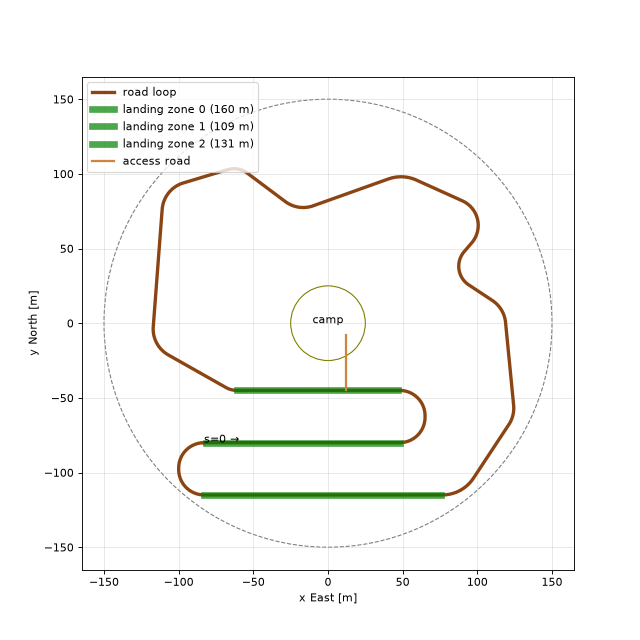

# Flatbed Falcon: project plan

Goal: a PX4 drone autonomously lands on the flatbed of an autonomously driven pickup truck in Gazebo. Both vehicles are independent agents that only share information over ROS 2 topics, as two real vehicles would over a radio link.



## System overview

```
 TRUCK AGENT                                    DRONE AGENT
 ┌──────────────────────────┐                   ┌──────────────────────────────┐
 │ road_centerline.csv      │                   │ target_tracker               │
 │   ↓                      │  /truck/odom      │  truck state → NED, KF,      │
 │ truck_driver             │ ────────────────► │  prediction  → /falcon/target│
 │  SplinePath + PurePursuit│  /truck/status    │   ↓                          │
 │  + speed profile         │ ◄──────────────── │ landing_controller           │
 │   ↓ /truck/cmd_vel       │  /falcon/request  │  state machine + tracking    │
 │ Gazebo Ackermann plugin  │                   │   ↓ /fmu/in/*                │
 └──────────────────────────┘                   │ PX4 offboard (x500)          │
                                                └──────────────────────────────┘
                    logger: CSV of all of the above → plots
```

## The world (done)

`worlds/generate_hive_base.py` now builds a **closed 1129 m road loop** around the camp, made of straights joined by circular arcs (radius 15–25 m):

- **Three landing zones**: straights with exactly zero curvature, marked in the world with white/orange posts at both ends.
  - Zone 0: south straight, 160 m
  - Zone 1: inner straight past the access road, 109 m
  - Zone 2: middle straight of the serpentine, 131 m
- **Hard parts for path following**: a serpentine with two 180° hairpins, an S-curve on the east side, and a tight 15 m crest curve in the north-west.
- **Clear corridor**: tree crowns, boulders and fallen logs are kept clear of the road, so nothing within 7 m of the centerline has collision geometry and the drone has open air above the truck.
- **Centerline export**: the generator also writes `worlds/road_centerline.csv`, with one point per meter: `s, x, y, heading, curvature, landing_zone` (world ENU, `landing_zone = -1` outside the zones). This is the single source of truth for the truck's path and for the cooperative landing logic.

To change the road, edit `ROAD_CORNERS` and rerun `python3 worlds/generate_hive_base.py`.

## Phases

Each phase ends in something that can be demonstrated in the simulator.

### Phase 1: Truck in the world
- [ ] Add a pickup model to the generator. It needs a dynamic model, unlike the static models already there:
  - chassis, cab, and a flatbed about 2.0 × 2.5 m at about 1.0 m height, with a high-friction landing pad and a visual marker
  - 4 wheels driven by `gz-sim-ackermann-steering-system`, with wheelbase L ≈ 3.0 m
  - `gz-sim-odometry-publisher-system` for ground-truth pose and twist
  - a contact sensor on the bed, used later for touchdown detection
- [ ] Spawn the truck on the road, at the start of zone 1 near the access road.
- [ ] Add a `ros_gz_bridge` config to the launch file: `/truck/cmd_vel` (Twist), `/truck/odom` (Odometry), `/truck/bed_contact`.
- [ ] Use `use_sim_time` in all nodes.

**Done when** `ros2 topic pub /truck/cmd_vel ...` drives the truck and `/truck/odom` reports its motion.

### Phase 2: Truck autonomy (`truck_driver`), reusing Lab 3
- [ ] Load `road_centerline.csv`, build a `SplinePath` (copy `HI3/splinepath.py` into the package), and handle the wrap-around at `s = 1129 m`.
- [ ] Lateral control: adapt `PurePursuitController` from `HI3/main.py`, using lookahead `l = l0 + k·v` and turning steering into a yaw rate with `ω = v·tan(δ)/L` for the Ackermann plugin.
- [ ] Longitudinal control: build a speed profile from curvature, `v_ref(s) = min(v_max, sqrt(a_lat,max / |κ(s)|))`, look ahead so the truck brakes before curves, and track it with a PI speed controller.
- [ ] Publish `/truck/status`: current `s`, `v`, whether the truck is in a landing zone, and the remaining distance in that zone.
- [ ] Optional: compare with Lab 3's LQR `StateFeedbackController`, which is a good report section.

**Done when** the truck drives laps without leaving the road, with a lateral error plot. Target: under 0.5 m on straights and under 1.0 m in hairpins.

### Phase 3: Target tracking (`target_tracker`)
- [ ] Convert `/truck/odom` (world ENU) into PX4 local NED with `frames.world_enu_to_px4_local()` and the drone spawn pose. Also convert velocity and yaw.
- [ ] Publish `/falcon/target`: bed position (body offset from the truck origin applied), velocity, and yaw.
- [ ] Add configurable Gaussian noise, latency, and dropout parameters to simulate a realistic link.

**Done when** the target's NED position matches the drone's NED position when the drone sits on the bed. This is the frame sanity check.

### Phase 4: Tracking flight (`landing_controller`, first part)
- [ ] PX4 offboard boilerplate: stream `OffboardControlMode` at ≥ 10 Hz, switch to offboard mode, arm.
- [ ] States `IDLE → TAKEOFF → APPROACH → TRACK`.
- [ ] TRACK sends `TrajectorySetpoint` with **position = predicted bed position + (0, 0, −h_track)** and **velocity = truck velocity** as feedforward, and the yaw follows the truck heading. PX4's inner position and velocity loops do the rest.
- [ ] Outer correction loop on the relative error: PD first, then LQR on a double integrator using `solve_discrete_are` as in Lab 3.

**Done when** the drone follows the truck at 4 m above the bed for a full lap, with horizontal error under 0.3 m on straights.

### Phase 5: Landing
- [ ] States `DESCEND → TOUCHDOWN → LANDED`, plus `ABORT → TRACK`.
- [ ] DESCEND is only allowed inside a landing zone, with enough zone left for the descent, after `|e_xy| < 0.3 m` and `|e_v| < 0.3 m/s` have held for 1.5 s.
- [ ] Descend at about 0.5 m/s inside a glide cone where the allowed error shrinks with height. Leaving the cone or reaching the end of the zone triggers ABORT and the drone climbs back to `h_track`.
- [ ] Touchdown at about 0.2 m above the bed: fast final descent, contact detected through the bed contact sensor or `e_z ≈ 0` with `v_z ≈ 0`, then force-disarm with `VehicleCommand` disarm `param2 = 21196`. PX4's own land detector is unreliable on a moving platform.
- [ ] Failsafes: target stale for more than 0.5 s means hover and climb; offboard setpoints lost means PX4 failsafe.

**Done when** the drone lands on the bed at 3 m/s and stays on through the following curves.

### Phase 6: Cooperation (Lab 4 idea)
- [ ] Handshake: the drone publishes `/falcon/request = READY_TO_LAND`. The truck replies through `/truck/status = LANDING_OK` when it enters a landing zone with enough length left, and it then **commits** to a constant speed until the zone ends or the drone reports `LANDED` or `ABORT`.
- [ ] The truck may slow down for the landing, as a cooperation knob to evaluate.
- [ ] After `LANDED`, the truck continues driving laps with the drone on the bed.

### Phase 7: Estimation and prediction (Labs 4 and 5)
- [ ] Kalman filter in `target_tracker` with a constant-velocity or constant-turn-rate model, fed by noisy, delayed measurements.
- [ ] Predict the bed position τ seconds ahead to compensate latency. The truck's known path (the CSV) can be used as a prior, so the prediction follows the road instead of a straight line.
- [ ] Stretch goal: a downward camera with an ArUco/AprilTag marker on the bed, fused into the filter during the final meters.

### Phase 8: Logging and evaluation (`logger`)
- [ ] CSV per run: time, truck state, drone state, target (raw, filtered, predicted), controller state, errors.
- [ ] Plot script for trajectories on the map, tracking error vs. time, a state-machine timeline, and touchdown position on the bed.
- [ ] Batch experiments (seeded): truck speed 2–8 m/s × noise × latency, measuring success rate, touchdown error, time to land, and number of aborts.

## Lab code reuse

| Lab | What we reuse | Where |
|---|---|---|
| Lab 3 (path following) | `SplinePath`, `PurePursuitController`, LQR state feedback, `solve_discrete_are` | `truck_driver`, outer loop in `landing_controller` |
| Lab 4 (collaborative control) | Cooperative agents, relative measurements, consensus thinking | landing handshake, relative-state filter |
| Lab 5 (trajectory prediction) | Predicting a vehicle's future position | `target_tracker` prediction step |
| Lab 1/2 (planning) | Graph search / lattice planner | Optional: plan the truck's exit from the parking area to the loop |

## Interfaces

| Topic | Type | From → to | Frame |
|---|---|---|---|
| `/truck/odom` | `nav_msgs/Odometry` | Gazebo → `truck_driver`, `target_tracker`, `logger` | world ENU |
| `/truck/cmd_vel` | `geometry_msgs/Twist` | `truck_driver` → Gazebo | truck body |
| `/truck/status` | custom or JSON `std_msgs/String` | `truck_driver` → drone | — |
| `/truck/bed_contact` | `ros_gz_interfaces/Contacts` | Gazebo → `landing_controller` | — |
| `/falcon/target` | `nav_msgs/Odometry` | `target_tracker` → `landing_controller`, `logger` | PX4 local NED |
| `/falcon/request` | custom or `std_msgs/String` | `landing_controller` → `truck_driver` | — |
| `/falcon/state` | `std_msgs/String` | `landing_controller` → `logger` | — |
| `/fmu/in/*`, `/fmu/out/*` | `px4_msgs` | PX4 bridge | PX4 local NED |

All frame conversions stay in `frames.py`.

## Starting parameters (tune in phases 2, 4 and 5)

| Parameter | Value |
|---|---|
| Truck max speed / lateral acceleration | 8 m/s / 2 m/s² (≈ 5.5 m/s in 15 m curves) |
| Pure Pursuit lookahead | `l = 3 m + 0.8 s · v` |
| Track height above bed | 4 m |
| Descent rate | 0.5 m/s, final 1.0 m/s below 0.2 m |
| Descent gate | `|e_xy| < 0.3 m`, `|e_v| < 0.3 m/s` for 1.5 s |
| Landing zone budget | ≥ 15 s of zone remaining at current speed |
| Setpoint rate | 20 Hz |

## Risks

| Risk | Mitigation |
|---|---|
| PX4 land detector fails on a moving platform | Own touchdown detection plus force-disarm |
| Drone slides off the bed in curves after landing | High-friction pad; stretch: detachable joint to latch the drone |
| Frame or offset bugs (ENU/NED, spawn offset) | Phase 3 sanity check, all conversions in `frames.py` |
| Sim slower than real time on a laptop | Run headless on Stellar for batch runs; all nodes on `use_sim_time` |
| Rotor downwash or ground effect near the bed | Accept in sim; keep final descent short |
| A landing zone is too short at high speed | Speed-dependent zone budget, ABORT at zone end, truck slows when committed |

## Open questions

1. Ground truth plus simulated noise, or camera and marker detection as the main target measurement? The current plan uses ground truth as the baseline and the camera as a stretch goal.
2. Should the drone take off from the camp (origin) and chase the truck, or start on the truck bed?
