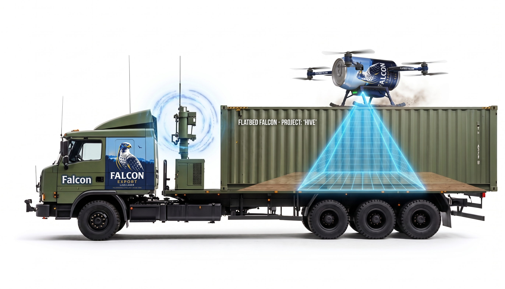

# Flatbed Falcon



A drone (PX4, x500) that autonomously tracks and lands on the flatbed of a moving pickup truck in Gazebo. Project for the Autonomous Vehicles course.

The truck drives laps on a 1.1 km forest road loop with Pure Pursuit, shares its position over ROS 2, and the drone follows it with PX4 Offboard setpoints before descending onto the flatbed on one of the straight landing zones.

See [PLAN.md](PLAN.md) for the design and work plan.

## Running

```bash
cd docker && ./start-dev.sh        # macOS: builds the image, starts PX4 + Gazebo (hive_base world)
./ros2_ws/run.sh                   # second terminal: builds and launches all nodes
./ros2_ws/view-camera.sh           # optional, third terminal: the gimbal camera in RViz
```

On the Stellar computers use `docker/start-stellar.sh` instead (see [docker/README-stellar.md](docker/README-stellar.md)).

The drone takes off from the camp, chases the truck and lands on its bed by itself. Each run writes a CSV to `logs/`. All tuning lives in `ros2_ws/src/flatbed_falcon/config/falcon.yaml` (controller mode and gains, speeds, landing gate, simulated link noise/latency, Kalman filter); `./ros2_ws/run.sh` rebuilds and picks up edits.

Offline tests (no Gazebo), inside the sim container:

```bash
docker exec -it flatbed-falcon-sim bash -c "cd /workspace/ros2_ws/src/flatbed_falcon && PYTHONPATH=. python3 -m pytest -q test"
```

## Layout

| Path | Contents |
|---|---|
| `docker/` | Simulation container (PX4 + Gazebo + ROS 2 Jazzy, pinned image) |
| `worlds/` | Gazebo world (`hive_base.sdf`, generated by `generate_hive_base.py`), road centerline (`road_centerline.csv`) and tree models |
| `ros2_ws/src/flatbed_falcon/` | ROS 2 package with all nodes |

| Node | Role |
|---|---|
| `truck_driver` | Pure Pursuit (Lab 3) + speed profile along the road loop, landing handshake |
| `target_tracker` | Truck pose (world ENU) → bed target (PX4 local NED); simulated link + Kalman filter |
| `landing_controller` | Lab 4 PD/PID (or LQR) tracking + landing state machine → PX4 Offboard |
| `logger` | CSV logs for plots |

All frame conversions (ENU ↔ NED, spawn offset) live in `flatbed_falcon/frames.py`.

The simulation environment and world are reused from our Hive project (Projectcourse in AI); everything under `ros2_ws/` is new for this course.
